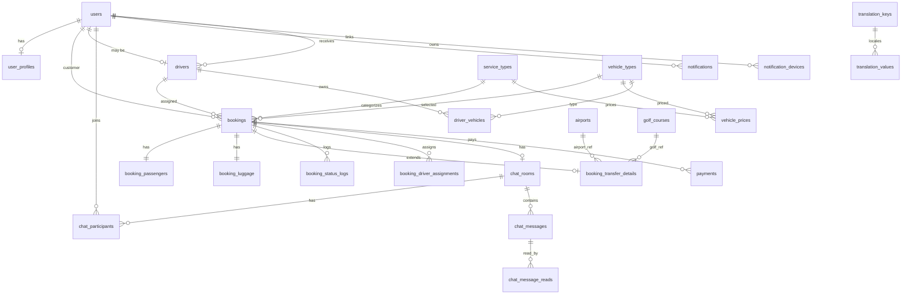

# Thailand Travel Platform — Database Master Design (v1.1)

> **단계**: 데이터 모델링 · ERD 수준 상세 설계 (SQL 미작성)  
> **다음 단계**: `database/00~11` 분할 SQL 생성  
> **DB**: MySQL 8 · InnoDB · `utf8mb4` · `utf8mb4_unicode_ci`  
> **v1.1 변경**: `DATABASE_ENHANCEMENT_REVIEW.md` 참고 (요금 라인·운영 로그·가격 규칙·files·audit)

### v1.1 Changelog (v1.0 → v1.1)

| 항목 | 변경 |
|------|------|
| NEW | `booking_charge_items`, `booking_admin_notes`, `booking_activity_logs` |
| NEW | `vehicle_price_rules`, `vehicle_price_rule_conditions` |
| NEW | `files` |
| MOD | `bookings` — 요금 상세 컬럼 제거, `total_amount` 합계만 |
| MOD | `booking_status_logs` — `reason`, `memo` |
| MOD | `booking_driver_assignments` — `unassigned_at`, `is_active`, `assignment_reason` |
| MOD | `chat_messages` — `reply_message_id`, `message_status` |
| MOD | `drivers` — `is_online`, `last_seen_at` |
| MOD | `golf_courses` — `phone`, `website` |
| MOD | `settings` — `data_type` (STRING/NUMBER/BOOLEAN/JSON) |
| MOD | 주요 테이블 — `created_by`, `updated_by` audit 패턴 |

---

## 1. ERD 개념 설명

### 1.1 도메인 영역 (Logical ERD Zones)

본 ERD는 **단일 예약 앱**이 아니라 **멀티 서비스 여행 플랫폼**을 가정하고, 6개 논리 영역으로 분리합니다.

```
┌─────────────────────────────────────────────────────────────────────────────┐
│  IDENTITY          │ users, user_profiles, roles (via users.role)            │
├────────────────────┼────────────────────────────────────────────────────────┤
│  SERVICE CATALOG   │ service_categories, service_types (확장용 카탈로그)      │
├────────────────────┼────────────────────────────────────────────────────────┤
│  BOOKING CORE      │ bookings, booking_passengers, booking_luggage,          │
│                    │ booking_transfer_details, booking_charge_items,           │
│                    │ booking_status_logs, booking_driver_assignments,          │
│                    │ booking_admin_notes, booking_activity_logs,               │
│                    │ booking_number_sequences                                  │
├────────────────────┼────────────────────────────────────────────────────────┤
│  FLEET & PLACES    │ vehicle_types, vehicle_prices, vehicle_price_rules,       │
│                    │ vehicle_price_rule_conditions, drivers, driver_vehicles,  │
│                    │ airports, golf_courses                                    │
├────────────────────┼────────────────────────────────────────────────────────┤
│  COMMUNICATION     │ chat_rooms, chat_participants, chat_messages,             │
│                    │ chat_message_reads, notifications, notification_devices   │
├────────────────────┼────────────────────────────────────────────────────────┤
│  COMMERCE (확장)   │ payments, wallets, coupons, points, memberships,        │
│                    │ affiliates, promotions (Phase 2+ — FK만 선연결)           │
├────────────────────┼────────────────────────────────────────────────────────┤
│  STORAGE           │ files                                                     │
│  PLATFORM          │ translations, settings, audit_logs (선택)                 │
└─────────────────────────────────────────────────────────────────────────────┘
```

### 1.2 ERD 관계 다이어그램 (개념)



### 1.3 핵심 설계 결정

| 결정 | 이유 |
|------|------|
| **`bookings`를 플랫폼 예약 허브** | Taxi·Tour·Restaurant 등 모든 예약이 동일 수명주기(상태·결제·알림)를 공유 |
| **`booking_transfer_details` 분리** | Transfer 전용 필드(항공·공항)를 코어 테이블 오염 없이 확장 |
| **향후 `booking_tour_details` 등 동일 패턴** | 서비스별 1:1 확장 테이블 (Class Table Inheritance) |
| **`booking_number` ≠ PK** | `id`(BIGINT)는 내부 FK용, `booking_number`(TX…)는 대외 식별자 |
| **Soft Delete 전 테이블** | `deleted_at` — 운영·감사·복구 |
| **Passenger / Luggage 1:1** | 현재 1예약 1세트; 향후 다중 세트 시 `booking_id` UNIQUE 제거만으로 확장 |
| **채팅 Read Status 분리 테이블** | 메시지 × 참여자 단위 읽음 (Socket·푸시와 정합) |
| **Translation 3NF** | locale 컬럼 나열(KO/EN…) 대신 `translation_values` — 언어 추가 용이 |

### 1.4 예약번호 생성 (논리)

- 테이블: `booking_number_sequences`
- 규칙: `TX` + `YYYYMMDD` + 4자리 일일 시퀀스 → `TX202607010001`
- 트랜잭션 내 `SELECT … FOR UPDATE` 또는 atomic UPDATE로 중복 방지 (SQL 단계에서 구현)

---

## 2. 전체 테이블 목록

### 2.1 Phase 1 — Airport Transfer MVP (필수)

| # | 테이블명 | 영역 |
|---|----------|------|
| 1 | `users` | Identity |
| 2 | `user_profiles` | Identity |
| 3 | `service_categories` | Catalog |
| 4 | `service_types` | Catalog |
| 5 | `bookings` | Booking |
| 6 | `booking_passengers` | Booking |
| 7 | `booking_luggage` | Booking |
| 8 | `booking_transfer_details` | Booking |
| 9 | `booking_status_logs` | Booking |
| 10 | `booking_driver_assignments` | Booking |
| 11 | `booking_number_sequences` | Booking |
| 12 | `vehicle_types` | Fleet |
| 13 | `vehicle_prices` | Fleet |
| 14 | `drivers` | Fleet |
| 15 | `driver_vehicles` | Fleet |
| 16 | `airports` | Places |
| 17 | `golf_courses` | Places |
| 18 | `chat_rooms` | Communication |
| 19 | `chat_participants` | Communication |
| 20 | `chat_messages` | Communication |
| 21 | `chat_message_reads` | Communication |
| 22 | `notifications` | Communication |
| 23 | `notification_devices` | Communication |
| 24 | `translation_keys` | Platform |
| 25 | `translation_values` | Platform |
| 26 | `settings` | Platform |

### 2.2 Phase 2+ — 확장 예정 (설계만 선반영)

| # | 테이블명 | 영역 |
|---|----------|------|
| 27 | `payments` | Commerce |
| 28 | `payment_transactions` | Commerce |
| 29 | `wallets` | Commerce |
| 30 | `wallet_transactions` | Commerce |
| 31 | `coupons` | Commerce |
| 32 | `coupon_usages` | Commerce |
| 33 | `point_accounts` | Commerce |
| 34 | `point_transactions` | Commerce |
| 35 | `membership_tiers` | Commerce |
| 36 | `user_memberships` | Commerce |
| 37 | `affiliates` | Commerce |
| 38 | `affiliate_referrals` | Commerce |
| 39 | `promotions` | Commerce |
| 40 | `promotion_rules` | Commerce |
| 41 | `booking_tour_details` | Booking (future) |
| 42 | `booking_restaurant_details` | Booking (future) |
| 43 | `booking_golf_reservation_details` | Booking (future) |
| 44 | `audit_logs` | Platform |

---

## 3. 각 테이블 역할

| 테이블 | 역할 |
|--------|------|
| `users` | 플랫폼 통합 계정 (고객·기사·관리자). 인증·Role·연락처·locale |
| `user_profiles` | 선택적 확장 프로필 (생년, 성별, 선호 언어, 마케팅 동의) |
| `service_categories` | 상위 분류: TRANSFER, GOLF, TOUR, RESTAURANT, TAXI |
| `service_types` | 실제 예약 단위: AIRPORT_PICKUP, CITY_TRANSFER, TOUR_PACKAGE 등 |
| `bookings` | **모든 예약의 코어** — 번호, 상태, 경로, 차량, 금액, 고객 스냅샷, 기사 |
| `booking_passengers` | 예약별 인원 (성인·어린이·유아) |
| `booking_luggage` | 예약별 수하물 |
| `booking_transfer_details` | 이동 서비스 전용: 공항, 항공편, 도착/연착, 골프장 FK |
| `booking_status_logs` | 상태 변경 이력 (알림·감사 트리거 소스) |
| `booking_driver_assignments` | 기사 배정·수락·완료 이력 (재배정 추적) |
| `booking_number_sequences` | 일별 예약번호 시퀀스 |
| `vehicle_types` | 차량 타입 마스터 (정원·수하물 한도) |
| `vehicle_prices` | service_type × vehicle_type 기본 요금 |
| `drivers` | 기사 엔티티 (상태, 평점, 위치 — 후순위 컬럼) |
| `driver_vehicles` | 기사 소유/운행 차량, 번호판 |
| `airports` | IATA/ICAO 공항 마스터 |
| `golf_courses` | 골프장 마스터 + Place ID |
| `chat_rooms` | 예약 1건 = 1 room (`room_TX…`) |
| `chat_participants` | room 참여자 (고객·기사·관리자) |
| `chat_messages` | 메시지 본문·타입·발신자 |
| `chat_message_reads` | 참여자별 읽음 시각 |
| `notifications` | Push/Email/SMS 채널 통합 알림 레코드 |
| `notification_devices` | FCM/APNs 토큰·디바이스 |
| `translation_keys` | 번역 키 (UI·동적 문구) |
| `translation_values` | locale별 번역 값 |
| `settings` | 시스템 설정 (API Key, SMTP 등 — 암호화 저장) |

---

## 4. 컬럼 설계

> 공통 컬럼 (대부분 테이블):  
> `created_at` DATETIME NOT NULL DEFAULT CURRENT_TIMESTAMP  
> `updated_at` DATETIME NOT NULL DEFAULT CURRENT_TIMESTAMP ON UPDATE CURRENT_TIMESTAMP  
> `deleted_at` DATETIME NULL DEFAULT NULL — Soft Delete  
> (아래 표에는 공통 컬럼 생략, 각 테이블에 **반드시 포함**)

---

### 4.1 `users`

| 컬럼명 | 데이터 타입 | NULL | DEFAULT | 설명 |
|--------|-------------|------|---------|------|
| `id` | BIGINT UNSIGNED | NO | — | 내부 PK |
| `email` | VARCHAR(255) | NO | — | 로그인 이메일 |
| `password_hash` | VARCHAR(255) | YES | NULL | bcrypt; 게스트 예약만 하는 고객은 NULL |
| `role` | ENUM(…) | NO | `CUSTOMER` | CUSTOMER, DRIVER, ADMIN, SUPER_ADMIN |
| `phone` | VARCHAR(30) | YES | NULL | E.164 권장 |
| `phone_country_code` | VARCHAR(5) | YES | NULL | +66 등 |
| `country_code` | CHAR(2) | YES | NULL | ISO 3166-1 alpha-2 |
| `locale` | VARCHAR(10) | NO | `ko` | UI 언어 |
| `is_active` | TINYINT(1) | NO | 1 | 계정 활성 |
| `email_verified_at` | DATETIME | YES | NULL | 이메일 인증 시각 |
| `last_login_at` | DATETIME | YES | NULL | 마지막 로그인 |

---

### 4.2 `user_profiles`

| 컬럼명 | 데이터 타입 | NULL | DEFAULT | 설명 |
|--------|-------------|------|---------|------|
| `id` | BIGINT UNSIGNED | NO | — | PK |
| `user_id` | BIGINT UNSIGNED | NO | — | FK → users |
| `display_name` | VARCHAR(100) | YES | NULL | 표시 이름 |
| `avatar_url` | VARCHAR(512) | YES | NULL | 프로필 이미지 |
| `birth_date` | DATE | YES | NULL | 생년월일 |
| `gender` | ENUM(`M`,`F`,`O`,`N`) | YES | NULL | 선택 |
| `marketing_opt_in` | TINYINT(1) | NO | 0 | 마케팅 수신 |
| `notes` | TEXT | YES | NULL | 내부 메모 |

---

### 4.3 `service_categories`

| 컬럼명 | 데이터 타입 | NULL | DEFAULT | 설명 |
|--------|-------------|------|---------|------|
| `id` | SMALLINT UNSIGNED | NO | — | PK |
| `code` | VARCHAR(30) | NO | — | TRANSFER, GOLF, TOUR, RESTAURANT, TAXI |
| `name` | VARCHAR(100) | NO | — | 표시명 |
| `sort_order` | SMALLINT | NO | 0 | 정렬 |
| `is_active` | TINYINT(1) | NO | 1 | 활성 |

---

### 4.4 `service_types`

| 컬럼명 | 데이터 타입 | NULL | DEFAULT | 설명 |
|--------|-------------|------|---------|------|
| `id` | SMALLINT UNSIGNED | NO | — | PK |
| `category_id` | SMALLINT UNSIGNED | NO | — | FK → service_categories |
| `code` | VARCHAR(40) | NO | — | AIRPORT_PICKUP 등 |
| `name` | VARCHAR(100) | NO | — | 표시명 |
| `description` | TEXT | YES | NULL | 설명 |
| `sort_order` | SMALLINT | NO | 0 | 정렬 |
| `is_active` | TINYINT(1) | NO | 1 | 활성 |

---

### 4.5 `bookings` ★ 코어 예약

| 컬럼명 | 데이터 타입 | NULL | DEFAULT | 설명 |
|--------|-------------|------|---------|------|
| `id` | BIGINT UNSIGNED | NO | — | 내부 PK (FK용) |
| `booking_number` | VARCHAR(20) | NO | — | 대외 번호 TX202607010001 |
| `status` | ENUM(…) | NO | `PENDING` | 예약 상태 (§9) |
| `service_type_id` | SMALLINT UNSIGNED | NO | — | FK → service_types |
| `origin_address` | VARCHAR(500) | YES | NULL | 출발지 주소 텍스트 |
| `origin_place_id` | VARCHAR(255) | YES | NULL | Google Place ID (출발) |
| `origin_lat` | DECIMAL(10,7) | YES | NULL | 출발 좌표 (향후 지도) |
| `origin_lng` | DECIMAL(10,7) | YES | NULL | 출발 좌표 |
| `destination_address` | VARCHAR(500) | YES | NULL | 도착지 주소 |
| `destination_place_id` | VARCHAR(255) | YES | NULL | Google Place ID (도착) |
| `destination_lat` | DECIMAL(10,7) | YES | NULL | 도착 좌표 |
| `destination_lng` | DECIMAL(10,7) | YES | NULL | 도착 좌표 |
| `scheduled_pickup_at` | DATETIME | YES | NULL | 예약 픽업/이용 일시 |
| `vehicle_type_id` | SMALLINT UNSIGNED | NO | — | FK → vehicle_types (선택 차량) |
| `recommended_vehicle_type_id` | SMALLINT UNSIGNED | YES | NULL | 자동 추천 차량 |
| `vehicle_count` | TINYINT UNSIGNED | NO | 1 | 배정 차량 대수 |
| `vehicle_base_price` | DECIMAL(12,2) | NO | 0.00 | 차량 기본 요금 합계 |
| `additional_charges` | DECIMAL(12,2) | NO | 0.00 | 추가요금 합계 |
| `name_sign_service` | TINYINT(1) | NO | 0 | 피켓 서비스 여부 |
| `name_sign_fee` | DECIMAL(12,2) | NO | 0.00 | 피켓 요금 |
| `discount_amount` | DECIMAL(12,2) | NO | 0.00 | 쿠폰·프로모션 (Phase 2) |
| `total_amount` | DECIMAL(12,2) | NO | 0.00 | 총금액 |
| `currency` | CHAR(3) | NO | `THB` | 통화 |
| `payment_status` | ENUM(…) | NO | `UNPAID` | 결제 상태 (§9) |
| `customer_user_id` | BIGINT UNSIGNED | YES | NULL | FK → users (회원 고객) |
| `customer_name` | VARCHAR(100) | NO | — | 예약 시점 고객명 스냅샷 |
| `customer_email` | VARCHAR(255) | NO | — | 이메일 스냅샷 |
| `customer_phone` | VARCHAR(30) | NO | — | 전화 스냅샷 |
| `customer_country_code` | CHAR(2) | YES | NULL | 국가 스냅샷 |
| `driver_id` | BIGINT UNSIGNED | YES | NULL | FK → drivers (현재 배정 기사) |
| `special_requests` | TEXT | YES | NULL | 추가 요청사항 |
| `admin_notes` | TEXT | YES | NULL | 관리자 내부 메모 |
| `cancelled_at` | DATETIME | YES | NULL | 취소 시각 |
| `cancellation_reason` | VARCHAR(500) | YES | NULL | 취소 사유 |
| `completed_at` | DATETIME | YES | NULL | 완료 시각 |
| `metadata` | JSON | YES | NULL | 확장용 (다중 차량 배정 JSON 등) |

---

### 4.6 `booking_passengers`

| 컬럼명 | 데이터 타입 | NULL | DEFAULT | 설명 |
|--------|-------------|------|---------|------|
| `id` | BIGINT UNSIGNED | NO | — | PK |
| `booking_id` | BIGINT UNSIGNED | NO | — | FK → bookings |
| `adults` | TINYINT UNSIGNED | NO | 1 | 성인 (12세+) |
| `children` | TINYINT UNSIGNED | NO | 0 | 어린이 |
| `infants` | TINYINT UNSIGNED | NO | 0 | 유아 (향후) |

---

### 4.7 `booking_luggage`

| 컬럼명 | 데이터 타입 | NULL | DEFAULT | 설명 |
|--------|-------------|------|---------|------|
| `id` | BIGINT UNSIGNED | NO | — | PK |
| `booking_id` | BIGINT UNSIGNED | NO | — | FK → bookings |
| `carriers_20_inch` | TINYINT UNSIGNED | NO | 0 | 20인치 캐리어 |
| `carriers_24_inch_plus` | TINYINT UNSIGNED | NO | 0 | 24인치 이상 |
| `golf_bags` | TINYINT UNSIGNED | NO | 0 | 골프백 |
| `special_items` | TEXT | YES | NULL | 특수 수하물 (유모차 등) |

---

### 4.8 `booking_transfer_details`

| 컬럼명 | 데이터 타입 | NULL | DEFAULT | 설명 |
|--------|-------------|------|---------|------|
| `id` | BIGINT UNSIGNED | NO | — | PK |
| `booking_id` | BIGINT UNSIGNED | NO | — | FK → bookings |
| `airport_id` | SMALLINT UNSIGNED | YES | NULL | FK → airports |
| `airport_code_custom` | VARCHAR(10) | YES | NULL | 기타 공항 IATA 수기 |
| `flight_number` | VARCHAR(20) | YES | NULL | 항공편 (KE651) |
| `flight_scheduled_arrival_at` | DATETIME | YES | NULL | Scheduled Arrival |
| `flight_estimated_arrival_at` | DATETIME | YES | NULL | Estimated Arrival |
| `delay_minutes` | SMALLINT | YES | NULL | 연착 분 |
| `delay_status` | VARCHAR(50) | YES | NULL | On time / Delayed 등 |
| `flight_raw_data` | JSON | YES | NULL | AviationStack 원본 |
| `golf_course_id` | INT UNSIGNED | YES | NULL | FK → golf_courses |
| `golf_region` | VARCHAR(50) | YES | NULL | 골프 지역 (캐시) |
| `driver_included` | TINYINT(1) | NO | 0 | 골프 기사 포함 |
| `pickup_time_local` | TIME | YES | NULL | 샌딩/시티 픽업 시간 |

---

### 4.9 `booking_status_logs`

| 컬럼명 | 데이터 타입 | NULL | DEFAULT | 설명 |
|--------|-------------|------|---------|------|
| `id` | BIGINT UNSIGNED | NO | — | PK |
| `booking_id` | BIGINT UNSIGNED | NO | — | FK → bookings |
| `from_status` | ENUM(…) | YES | NULL | 이전 상태 |
| `to_status` | ENUM(…) | NO | — | 변경 후 상태 |
| `changed_by_user_id` | BIGINT UNSIGNED | YES | NULL | FK → users |
| `changed_by_role` | ENUM(…) | YES | NULL | 변경 주체 Role |
| `note` | VARCHAR(500) | YES | NULL | 사유 |

---

### 4.10 `booking_driver_assignments`

| 컬럼명 | 데이터 타입 | NULL | DEFAULT | 설명 |
|--------|-------------|------|---------|------|
| `id` | BIGINT UNSIGNED | NO | — | PK |
| `booking_id` | BIGINT UNSIGNED | NO | — | FK → bookings |
| `driver_id` | BIGINT UNSIGNED | NO | — | FK → drivers |
| `driver_vehicle_id` | BIGINT UNSIGNED | YES | NULL | FK → driver_vehicles |
| `status` | ENUM(`ASSIGNED`,`ACCEPTED`,`REJECTED`,`COMPLETED`,`CANCELLED`) | NO | `ASSIGNED` | 배정 상태 |
| `assigned_by_user_id` | BIGINT UNSIGNED | YES | NULL | FK → users (관리자) |
| `assigned_at` | DATETIME | NO | CURRENT_TIMESTAMP | 배정 시각 |
| `accepted_at` | DATETIME | YES | NULL | 기사 수락 |
| `completed_at` | DATETIME | YES | NULL | 완료 |

---

### 4.11 `booking_number_sequences`

| 컬럼명 | 데이터 타입 | NULL | DEFAULT | 설명 |
|--------|-------------|------|---------|------|
| `id` | INT UNSIGNED | NO | — | PK |
| `date_prefix` | CHAR(8) | NO | — | YYYYMMDD |
| `last_sequence` | INT UNSIGNED | NO | 0 | 당일 마지막 시퀀스 |

---

### 4.12 `vehicle_types`

| 컬럼명 | 데이터 타입 | NULL | DEFAULT | 설명 |
|--------|-------------|------|---------|------|
| `id` | SMALLINT UNSIGNED | NO | — | PK |
| `code` | ENUM(…) | NO | — | SEDAN, SUV, … (§9) |
| `name` | VARCHAR(50) | NO | — | 차량명 |
| `max_passengers` | TINYINT UNSIGNED | NO | — | 최대 인원 |
| `max_luggage` | TINYINT UNSIGNED | NO | — | 최대 수하물 개수 |
| `description` | VARCHAR(255) | YES | NULL | 설명 |
| `sort_order` | SMALLINT | NO | 0 | UI 정렬 |
| `is_active` | TINYINT(1) | NO | 1 | 활성 |

> **Note**: 단가는 `vehicle_prices`에서 관리. `vehicle_types`에 price 컬럼 없음 (3NF).

---

### 4.13 `vehicle_prices`

| 컬럼명 | 데이터 타입 | NULL | DEFAULT | 설명 |
|--------|-------------|------|---------|------|
| `id` | INT UNSIGNED | NO | — | PK |
| `service_type_id` | SMALLINT UNSIGNED | NO | — | FK → service_types |
| `vehicle_type_id` | SMALLINT UNSIGNED | NO | — | FK → vehicle_types |
| `base_price` | DECIMAL(12,2) | NO | — | 기본 요금 |
| `currency` | CHAR(3) | NO | `THB` | 통화 |
| `region_code` | VARCHAR(30) | YES | NULL | 향후 지역별 요금 |
| `is_active` | TINYINT(1) | NO | 1 | 활성 |

---

### 4.14 `drivers`

| 컬럼명 | 데이터 타입 | NULL | DEFAULT | 설명 |
|--------|-------------|------|---------|------|
| `id` | BIGINT UNSIGNED | NO | — | PK |
| `user_id` | BIGINT UNSIGNED | YES | NULL | FK → users (로그인 연동) |
| `name` | VARCHAR(100) | NO | — | 기사명 |
| `phone` | VARCHAR(30) | NO | — | 전화 |
| `license_number` | VARCHAR(50) | YES | NULL | 면허 번호 |
| `status` | ENUM(`AVAILABLE`,`ON_TRIP`,`OFFLINE`,`SUSPENDED`) | NO | `OFFLINE` | 기사 상태 |
| `primary_vehicle_type_id` | SMALLINT UNSIGNED | YES | NULL | FK → vehicle_types |
| `rating_avg` | DECIMAL(3,2) | YES | NULL | 평균 평점 (향후) |
| `rating_count` | INT UNSIGNED | NO | 0 | 평점 건수 |
| `current_lat` | DECIMAL(10,7) | YES | NULL | 현재 위치 (향후) |
| `current_lng` | DECIMAL(10,7) | YES | NULL | 현재 위치 |
| `location_updated_at` | DATETIME | YES | NULL | 위치 갱신 시각 |
| `is_active` | TINYINT(1) | NO | 1 | 활성 |

---

### 4.15 `driver_vehicles`

| 컬럼명 | 데이터 타입 | NULL | DEFAULT | 설명 |
|--------|-------------|------|---------|------|
| `id` | BIGINT UNSIGNED | NO | — | PK |
| `driver_id` | BIGINT UNSIGNED | NO | — | FK → drivers |
| `vehicle_type_id` | SMALLINT UNSIGNED | NO | — | FK → vehicle_types |
| `plate_number` | VARCHAR(20) | NO | — | 번호판 |
| `model_name` | VARCHAR(100) | YES | NULL | 차량 모델명 |
| `color` | VARCHAR(30) | YES | NULL | 색상 |
| `is_primary` | TINYINT(1) | NO | 0 | 주 운행 차량 |
| `is_active` | TINYINT(1) | NO | 1 | 활성 |

---

### 4.16 `airports`

| 컬럼명 | 데이터 타입 | NULL | DEFAULT | 설명 |
|--------|-------------|------|---------|------|
| `id` | SMALLINT UNSIGNED | NO | — | PK |
| `iata_code` | CHAR(3) | NO | — | IATA (BKK) |
| `icao_code` | CHAR(4) | YES | NULL | ICAO |
| `country_code` | CHAR(2) | NO | `TH` | 국가 |
| `city` | VARCHAR(100) | YES | NULL | 도시 |
| `name` | VARCHAR(200) | NO | — | 공항명 |
| `timezone` | VARCHAR(50) | YES | NULL | Asia/Bangkok |
| `is_active` | TINYINT(1) | NO | 1 | 활성 |

---

### 4.17 `golf_courses`

| 컬럼명 | 데이터 타입 | NULL | DEFAULT | 설명 |
|--------|-------------|------|---------|------|
| `id` | INT UNSIGNED | NO | — | PK |
| `region` | VARCHAR(50) | NO | — | Bangkok, Pattaya 등 |
| `name` | VARCHAR(200) | NO | — | 골프장명 |
| `address` | VARCHAR(500) | YES | NULL | 주소 |
| `place_id` | VARCHAR(255) | YES | NULL | Google Place ID |
| `lat` | DECIMAL(10,7) | YES | NULL | 좌표 |
| `lng` | DECIMAL(10,7) | YES | NULL | 좌표 |
| `is_active` | TINYINT(1) | NO | 1 | 활성 |

---

### 4.18 `chat_rooms`

| 컬럼명 | 데이터 타입 | NULL | DEFAULT | 설명 |
|--------|-------------|------|---------|------|
| `id` | BIGINT UNSIGNED | NO | — | PK |
| `booking_id` | BIGINT UNSIGNED | NO | — | FK → bookings |
| `room_code` | VARCHAR(50) | NO | — | room_TX202607010001 |
| `is_active` | TINYINT(1) | NO | 1 | 활성 |

---

### 4.19 `chat_participants`

| 컬럼명 | 데이터 타입 | NULL | DEFAULT | 설명 |
|--------|-------------|------|---------|------|
| `id` | BIGINT UNSIGNED | NO | — | PK |
| `chat_room_id` | BIGINT UNSIGNED | NO | — | FK → chat_rooms |
| `user_id` | BIGINT UNSIGNED | YES | NULL | FK → users |
| `participant_role` | ENUM(`CUSTOMER`,`DRIVER`,`ADMIN`) | NO | — | 참여 Role |
| `display_name` | VARCHAR(100) | NO | — | 채팅 표시명 |
| `last_read_at` | DATETIME | YES | NULL | room 전체 마지막 읽음 |
| `joined_at` | DATETIME | NO | CURRENT_TIMESTAMP | 참여 시각 |

---

### 4.20 `chat_messages`

| 컬럼명 | 데이터 타입 | NULL | DEFAULT | 설명 |
|--------|-------------|------|---------|------|
| `id` | BIGINT UNSIGNED | NO | — | PK |
| `chat_room_id` | BIGINT UNSIGNED | NO | — | FK → chat_rooms |
| `sender_user_id` | BIGINT UNSIGNED | YES | NULL | FK → users |
| `sender_role` | ENUM(`CUSTOMER`,`DRIVER`,`ADMIN`) | NO | — | 발신 Role |
| `sender_name` | VARCHAR(100) | NO | — | 발신자명 스냅샷 |
| `message_type` | ENUM(`TEXT`,`IMAGE`,`FILE`,`SYSTEM`) | NO | `TEXT` | 메시지 타입 |
| `content` | TEXT | NO | — | 본문 (파일은 URL) |
| `metadata` | JSON | YES | NULL | 파일 메타 등 |

---

### 4.21 `chat_message_reads`

| 컬럼명 | 데이터 타입 | NULL | DEFAULT | 설명 |
|--------|-------------|------|---------|------|
| `id` | BIGINT UNSIGNED | NO | — | PK |
| `chat_message_id` | BIGINT UNSIGNED | NO | — | FK → chat_messages |
| `chat_participant_id` | BIGINT UNSIGNED | NO | — | FK → chat_participants |
| `read_at` | DATETIME | NO | CURRENT_TIMESTAMP | 읽음 시각 |

---

### 4.22 `notifications`

| 컬럼명 | 데이터 타입 | NULL | DEFAULT | 설명 |
|--------|-------------|------|---------|------|
| `id` | BIGINT UNSIGNED | NO | — | PK |
| `user_id` | BIGINT UNSIGNED | NO | — | FK → users |
| `booking_id` | BIGINT UNSIGNED | YES | NULL | FK → bookings |
| `channel` | ENUM(`PUSH`,`EMAIL`,`SMS`) | NO | — | 발송 채널 |
| `type` | VARCHAR(50) | NO | — | BOOKING_CONFIRMED 등 |
| `title` | VARCHAR(255) | NO | — | 제목 |
| `body` | TEXT | YES | NULL | 본문 |
| `payload` | JSON | YES | NULL | 딥링크·데이터 |
| `status` | ENUM(`PENDING`,`SENT`,`FAILED`,`READ`) | NO | `PENDING` | 상태 |
| `sent_at` | DATETIME | YES | NULL | 발송 완료 |
| `read_at` | DATETIME | YES | NULL | 사용자 읽음 |
| `error_message` | VARCHAR(500) | YES | NULL | 실패 사유 |

---

### 4.23 `notification_devices`

| 컬럼명 | 데이터 타입 | NULL | DEFAULT | 설명 |
|--------|-------------|------|---------|------|
| `id` | BIGINT UNSIGNED | NO | — | PK |
| `user_id` | BIGINT UNSIGNED | NO | — | FK → users |
| `platform` | ENUM(`WEB`,`ANDROID`,`IOS`) | NO | — | 플랫폼 |
| `fcm_token` | VARCHAR(512) | NO | — | FCM 토큰 |
| `device_id` | VARCHAR(100) | YES | NULL | 디바이스 식별 |
| `is_active` | TINYINT(1) | NO | 1 | 활성 |
| `last_used_at` | DATETIME | YES | NULL | 마지막 사용 |

---

### 4.24 `translation_keys`

| 컬럼명 | 데이터 타입 | NULL | DEFAULT | 설명 |
|--------|-------------|------|---------|------|
| `id` | INT UNSIGNED | NO | — | PK |
| `key_name` | VARCHAR(150) | NO | — | 번역 키 |
| `category` | VARCHAR(50) | YES | NULL | ui, email, push 등 |
| `description` | VARCHAR(255) | YES | NULL | 관리자용 설명 |

---

### 4.25 `translation_values`

| 컬럼명 | 데이터 타입 | NULL | DEFAULT | 설명 |
|--------|-------------|------|---------|------|
| `id` | INT UNSIGNED | NO | — | PK |
| `translation_key_id` | INT UNSIGNED | NO | — | FK → translation_keys |
| `locale` | ENUM(`ko`,`en`,`th`,`ja`,`zh`) | NO | — | 언어 |
| `value` | TEXT | NO | — | 번역 문구 |

> 요구사항의 KO/EN/TH/JA/ZH 컬럼을 **3NF**로 `locale` + `value` 행 분리. 언어 추가 시 ENUM 확장 또는 VARCHAR 전환.

---

### 4.26 `settings`

| 컬럼명 | 데이터 타입 | NULL | DEFAULT | 설명 |
|--------|-------------|------|---------|------|
| `id` | INT UNSIGNED | NO | — | PK |
| `group_name` | VARCHAR(50) | NO | — | google, aviation, firebase, socket, smtp, general |
| `key_name` | VARCHAR(100) | NO | — | 설정 키 |
| `value` | TEXT | YES | NULL | 값 (암호화 대상) |
| `value_type` | ENUM(`STRING`,`NUMBER`,`BOOLEAN`,`JSON`,`SECRET`) | NO | `STRING` | 타입 |
| `is_encrypted` | TINYINT(1) | NO | 0 | 암호화 여부 |
| `description` | VARCHAR(255) | YES | NULL | 설명 |
| `updated_by_user_id` | BIGINT UNSIGNED | YES | NULL | FK → users |

---

### 4.27 Phase 2 스키마 개요 (컬럼은 SQL 단계)

| 테이블 | 핵심 FK | 역할 |
|--------|---------|------|
| `payments` | booking_id, user_id | 결제 헤더 |
| `payment_transactions` | payment_id | PG 트랜잭션 |
| `wallets` | user_id | 잔액 |
| `wallet_transactions` | wallet_id | 입출금 |
| `coupons` | — | 쿠폰 마스터 |
| `coupon_usages` | coupon_id, booking_id | 사용 이력 |
| `point_accounts` | user_id | 포인트 |
| `point_transactions` | point_account_id | 적립/사용 |
| `membership_tiers` | — | 등급 |
| `user_memberships` | user_id, tier_id | 회원 등급 |
| `affiliates` | user_id | 제휴 |
| `affiliate_referrals` | affiliate_id, booking_id | 추천 |
| `promotions` | — | 프로모션 |
| `promotion_rules` | promotion_id | 규칙 |

---

## 5. Primary Key

| 테이블 | PK | 타입 |
|--------|-----|------|
| 모든 테이블 | `id` | BIGINT/INT UNSIGNED AUTO_INCREMENT (sequences 테이블 포함) |

**원칙**: 대외 식별자(`booking_number`, `room_code`, `iata_code`)는 UNIQUE이지만 PK 아님.

---

## 6. Foreign Key

| 자식 테이블 | FK 컬럼 | 부모 테이블 | ON DELETE | ON UPDATE |
|-------------|---------|-------------|-----------|-------------|
| `user_profiles` | `user_id` | `users` | CASCADE | CASCADE |
| `service_types` | `category_id` | `service_categories` | RESTRICT | CASCADE |
| `bookings` | `service_type_id` | `service_types` | RESTRICT | CASCADE |
| `bookings` | `vehicle_type_id` | `vehicle_types` | RESTRICT | CASCADE |
| `bookings` | `recommended_vehicle_type_id` | `vehicle_types` | SET NULL | CASCADE |
| `bookings` | `customer_user_id` | `users` | SET NULL | CASCADE |
| `bookings` | `driver_id` | `drivers` | SET NULL | CASCADE |
| `booking_passengers` | `booking_id` | `bookings` | CASCADE | CASCADE |
| `booking_luggage` | `booking_id` | `bookings` | CASCADE | CASCADE |
| `booking_transfer_details` | `booking_id` | `bookings` | CASCADE | CASCADE |
| `booking_transfer_details` | `airport_id` | `airports` | SET NULL | CASCADE |
| `booking_transfer_details` | `golf_course_id` | `golf_courses` | SET NULL | CASCADE |
| `booking_status_logs` | `booking_id` | `bookings` | CASCADE | CASCADE |
| `booking_status_logs` | `changed_by_user_id` | `users` | SET NULL | CASCADE |
| `booking_driver_assignments` | `booking_id` | `bookings` | CASCADE | CASCADE |
| `booking_driver_assignments` | `driver_id` | `drivers` | RESTRICT | CASCADE |
| `booking_driver_assignments` | `driver_vehicle_id` | `driver_vehicles` | SET NULL | CASCADE |
| `booking_driver_assignments` | `assigned_by_user_id` | `users` | SET NULL | CASCADE |
| `vehicle_prices` | `service_type_id` | `service_types` | RESTRICT | CASCADE |
| `vehicle_prices` | `vehicle_type_id` | `vehicle_types` | RESTRICT | CASCADE |
| `drivers` | `user_id` | `users` | SET NULL | CASCADE |
| `drivers` | `primary_vehicle_type_id` | `vehicle_types` | SET NULL | CASCADE |
| `driver_vehicles` | `driver_id` | `drivers` | CASCADE | CASCADE |
| `driver_vehicles` | `vehicle_type_id` | `vehicle_types` | RESTRICT | CASCADE |
| `chat_rooms` | `booking_id` | `bookings` | CASCADE | CASCADE |
| `chat_participants` | `chat_room_id` | `chat_rooms` | CASCADE | CASCADE |
| `chat_participants` | `user_id` | `users` | SET NULL | CASCADE |
| `chat_messages` | `chat_room_id` | `chat_rooms` | CASCADE | CASCADE |
| `chat_messages` | `sender_user_id` | `users` | SET NULL | CASCADE |
| `chat_message_reads` | `chat_message_id` | `chat_messages` | CASCADE | CASCADE |
| `chat_message_reads` | `chat_participant_id` | `chat_participants` | CASCADE | CASCADE |
| `notifications` | `user_id` | `users` | CASCADE | CASCADE |
| `notifications` | `booking_id` | `bookings` | SET NULL | CASCADE |
| `notification_devices` | `user_id` | `users` | CASCADE | CASCADE |
| `translation_values` | `translation_key_id` | `translation_keys` | CASCADE | CASCADE |
| `settings` | `updated_by_user_id` | `users` | SET NULL | CASCADE |

---

## 7. Index

| 테이블 | 인덱스명 (권장) | 컬럼 | 유형 |
|--------|-----------------|------|------|
| `users` | `idx_users_email` | `email` | UNIQUE (deleted_at 고려 §11) |
| `users` | `idx_users_role_active` | `role`, `is_active` | INDEX |
| `users` | `idx_users_phone` | `phone` | INDEX |
| `bookings` | `uk_bookings_number` | `booking_number` | UNIQUE |
| `bookings` | `idx_bookings_status_scheduled` | `status`, `scheduled_pickup_at` | INDEX |
| `bookings` | `idx_bookings_customer` | `customer_user_id` | INDEX |
| `bookings` | `idx_bookings_driver` | `driver_id` | INDEX |
| `bookings` | `idx_bookings_service_type` | `service_type_id` | INDEX |
| `bookings` | `idx_bookings_created` | `created_at` | INDEX |
| `bookings` | `idx_bookings_payment_status` | `payment_status` | INDEX |
| `booking_passengers` | `uk_booking_passengers_booking` | `booking_id` | UNIQUE |
| `booking_luggage` | `uk_booking_luggage_booking` | `booking_id` | UNIQUE |
| `booking_transfer_details` | `uk_transfer_booking` | `booking_id` | UNIQUE |
| `booking_transfer_details` | `idx_transfer_flight` | `flight_number`, `flight_scheduled_arrival_at` | INDEX |
| `booking_status_logs` | `idx_status_logs_booking` | `booking_id`, `created_at` | INDEX |
| `booking_driver_assignments` | `idx_assignments_booking` | `booking_id` | INDEX |
| `booking_driver_assignments` | `idx_assignments_driver` | `driver_id`, `status` | INDEX |
| `booking_number_sequences` | `uk_seq_date` | `date_prefix` | UNIQUE |
| `vehicle_prices` | `uk_vehicle_price` | `service_type_id`, `vehicle_type_id`, `region_code` | UNIQUE |
| `drivers` | `idx_drivers_user` | `user_id` | UNIQUE (nullable) |
| `drivers` | `idx_drivers_status` | `status`, `is_active` | INDEX |
| `driver_vehicles` | `idx_driver_vehicles_driver` | `driver_id` | INDEX |
| `driver_vehicles` | `uk_plate` | `plate_number` | UNIQUE |
| `airports` | `uk_airports_iata` | `iata_code` | UNIQUE |
| `golf_courses` | `idx_golf_region` | `region`, `is_active` | INDEX |
| `chat_rooms` | `uk_chat_room_code` | `room_code` | UNIQUE |
| `chat_rooms` | `uk_chat_room_booking` | `booking_id` | UNIQUE |
| `chat_participants` | `uk_participant` | `chat_room_id`, `participant_role`, `user_id` | UNIQUE |
| `chat_messages` | `idx_messages_room_time` | `chat_room_id`, `created_at` | INDEX |
| `notifications` | `idx_notif_user_read` | `user_id`, `read_at`, `created_at` | INDEX |
| `notifications` | `idx_notif_booking` | `booking_id` | INDEX |
| `notification_devices` | `idx_fcm_token` | `fcm_token` | INDEX |
| `notification_devices` | `uk_user_device` | `user_id`, `device_id` | UNIQUE |
| `translation_keys` | `uk_translation_key` | `key_name` | UNIQUE |
| `translation_values` | `uk_key_locale` | `translation_key_id`, `locale` | UNIQUE |
| `settings` | `uk_settings_key` | `group_name`, `key_name` | UNIQUE |

---

## 8. Unique Key

| 제약 | 테이블 | 컬럼 | 비고 |
|------|--------|------|------|
| 예약번호 | `bookings` | `booking_number` | 대외 식별 |
| 이메일 | `users` | `email` | Soft delete 시 partial unique 권장 (§13) |
| 채팅 room | `chat_rooms` | `room_code`, `booking_id` | 1예약 1room |
| IATA | `airports` | `iata_code` | |
| 번호판 | `driver_vehicles` | `plate_number` | |
| 요금 | `vehicle_prices` | service + vehicle + region | |
| 번역 | `translation_values` | key + locale | |
| 설정 | `settings` | group + key | |
| 일일 시퀀스 | `booking_number_sequences` | `date_prefix` | |

---

## 9. ENUM 목록

### 9.1 `users.role`
`CUSTOMER`, `DRIVER`, `ADMIN`, `SUPER_ADMIN`

### 9.2 `bookings.status` (예약 상태)
`PENDING`, `CONFIRMED`, `DRIVER_ASSIGNED`, `DRIVER_ARRIVED`, `PICKED_UP`, `COMPLETED`, `CANCELLED`, `NO_SHOW`

### 9.3 `bookings.payment_status`
`UNPAID`, `PENDING`, `PAID`, `REFUNDED`, `FAILED`

### 9.4 `service_types.code` (Phase 1 — seed)
`AIRPORT_PICKUP`, `AIRPORT_DROPOFF`, `CITY_TRANSFER`, `GOLF_TRANSFER`

### 9.5 `vehicle_types.code`
`SEDAN`, `SUV`, `VIP_SUV`, `VAN`, `VIP_VAN`, `LUXURY`

### 9.6 `drivers.status`
`AVAILABLE`, `ON_TRIP`, `OFFLINE`, `SUSPENDED`

### 9.7 `booking_driver_assignments.status`
`ASSIGNED`, `ACCEPTED`, `REJECTED`, `COMPLETED`, `CANCELLED`

### 9.8 `chat_messages.message_type`
`TEXT`, `IMAGE`, `FILE`, `SYSTEM`

### 9.9 `chat_participants.participant_role` / `chat_messages.sender_role`
`CUSTOMER`, `DRIVER`, `ADMIN`

### 9.10 `notifications.channel`
`PUSH`, `EMAIL`, `SMS`

### 9.11 `notifications.status`
`PENDING`, `SENT`, `FAILED`, `READ`

### 9.12 `notification_devices.platform`
`WEB`, `ANDROID`, `IOS`

### 9.13 `translation_values.locale`
`ko`, `en`, `th`, `ja`, `zh`

### 9.14 `settings.value_type`
`STRING`, `NUMBER`, `BOOLEAN`, `JSON`, `SECRET`

### 9.15 `user_profiles.gender`
`M`, `F`, `O`, `N`

---

## 10. 테이블 관계 설명

### 10.1 예약 생성 플로우 (데이터 흐름)

```
service_types (AIRPORT_PICKUP)
    → bookings (코어 + 금액 + 고객 스냅샷)
        → booking_passengers (1:1)
        → booking_luggage (1:1)
        → booking_transfer_details (1:1, 항공·공항)
        → booking_status_logs (1:N, PENDING 기록)
        → chat_rooms (1:1)
            → chat_participants (N, 고객·기사·관리자)
    → booking_number_sequences (시퀀스 증가)
```

### 10.2 기사 배정

```
drivers ← booking_driver_assignments → bookings
driver_vehicles → booking_driver_assignments (운행 차량)
bookings.driver_id = 현재 활성 배정 기사 (조회 최적화용 denormalization — §13)
```

### 10.3 가격

```
vehicle_types + service_types → vehicle_prices (기본 단가)
bookings.vehicle_base_price = 예약 시점 확정 스냅샷 (마스터 변경과 무관)
```

### 10.4 채팅 읽음

```
chat_messages → chat_message_reads ← chat_participants
(메시지당 참여자별 read_at — Socket mark_read와 1:1 대응)
```

### 10.5 알림

```
booking_status_logs / bookings 상태 변경
    → notifications (channel: PUSH/EMAIL/SMS)
    → notification_devices.fcm_token (PUSH)
```

### 10.6 Cardinality 요약

| 관계 | 타입 |
|------|------|
| users ↔ bookings (customer) | 1:N |
| bookings ↔ booking_passengers | 1:1 |
| bookings ↔ booking_luggage | 1:1 |
| bookings ↔ booking_transfer_details | 1:1 |
| bookings ↔ chat_rooms | 1:1 |
| chat_rooms ↔ chat_messages | 1:N |
| drivers ↔ bookings (current) | 1:N |
| service_types ↔ bookings | 1:N |
| vehicle_types ↔ vehicle_prices | 1:N |

---

## 11. 조회 성능을 위한 Index 전략

### 11.1 관리자 대시보드

| 조회 | 인덱스 |
|------|--------|
| 오늘 예약 건수 | `bookings(created_at)` + 날짜 범위 |
| 오늘 매출 | `bookings(created_at, payment_status, total_amount)` |
| 상태별 통계 | `bookings(status)` 또는 커버링 집계 테이블 (Phase 2) |
| 대기 예약 | `bookings(status, scheduled_pickup_at)` WHERE status=PENDING |
| 기사 배정 대기 | `bookings(status)` WHERE CONFIRMED |
| 활성 채팅 | `bookings(status)` + `chat_rooms(is_active)` |

### 11.2 고객·기사 앱

| 조회 | 인덱스 |
|------|--------|
| 내 예약 목록 | `bookings(customer_user_id, created_at DESC)` |
| 예약번호 조회 | `bookings(booking_number)` UNIQUE |
| 기사 배정 목록 | `booking_driver_assignments(driver_id, status)` |
| 채팅 히스토리 | `chat_messages(chat_room_id, created_at)` |

### 11.3 Soft Delete와 Index

- 모든 목록 조회: `WHERE deleted_at IS NULL` 포함
- **Partial Index** (MySQL 8.0.13+):  
  `CREATE INDEX idx_bookings_active_status ON bookings(status, scheduled_pickup_at) WHERE deleted_at IS NULL`  
  (SQL 단계에서 적용 여부 결정)

### 11.4 이메일 Unique + Soft Delete

- `UNIQUE(email)`은 삭제된 계정 재등록 불가
- 권장: `UNIQUE(email, deleted_at)` 또는 generated column `email_active` (§13)

### 11.5 대용량 대비

| 전략 | 시점 |
|------|------|
| `bookings` 연도 파티션 (`PARTITION BY RANGE (YEAR(created_at))`) | 연 예약 100만+ |
| `chat_messages` 아카이브 테이블 | 메시지 1천만+ |
| 일별 집계 `booking_daily_stats` (materialized) | 대시보드 지연 발생 시 |
| Read Replica | 리포팅·관리자 조회 분리 |

---

## 12. 향후 확장 가능한 구조

### 12.1 서비스 확장 패턴

```
service_categories (TOUR)
    → service_types (TOUR_DAY_PACKAGE)
        → bookings (동일 코어)
            → booking_tour_details (1:1, 투어 전용)
            → booking_restaurant_details (1:1)
            → booking_golf_reservation_details (1:1, 골프 예약 — transfer와 구분)
```

**원칙**: 코어(`bookings`)는 상태·결제·알림·채팅 공유; 서비스별 테이블만 추가.

### 12.2 결제·포인트·쿠폰

```
bookings.payment_status (요약)
payments (1:N 가능 — 분할결제)
wallet_transactions / point_transactions → bookings.id 참조
coupon_usages → bookings.id
```

### 12.3 멤버십·제휴

```
user_memberships → 할인율은 promotion_rules 또는 vehicle_prices override
affiliate_referrals → bookings.tracking_code (향후 컬럼 추가)
```

### 12.4 Taxi 실시간 (향후)

```
drivers.current_lat/lng + 공간 인덱스 (POINT + SPATIAL)
별도 trip_sessions 테이블 (실시간 배차 vs 사전 예약 bookings 분리 검토)
```

### 12.5 다국어

- **정적 UI**: Flutter ARB (앱 빌드)
- **동적/운영 문구**: `translation_keys` + `translation_values`
- **마스터 데이터 번역**: `airport_translations`, `golf_course_translations` (향후)

### 12.6 Storage (파일)

향후 `files` 테이블: `entity_type`, `entity_id`, `storage_provider`, `path`, `url`

---

## 13. 개선 제안

| # | 제안 | 이유 |
|---|------|------|
| 1 | **`bookings.driver_id` denormalization 유지** | 현재 배정 기사 빠른 조회; `booking_driver_assignments`로 이력·진실 공급원 |
| 2 | **이메일 Partial Unique** | Soft delete 후 동일 이메일 재가입 |
| 3 | **`translation_values.locale` → VARCHAR(10)** | ENUM 대신 — 언어 추가 시 DDL 변경 불필요 |
| 4 | **`booking_additional_charges` 라인 아이템 테이블** | 추가요금·쿠폰·프로모션을 행 단위로 (감사·정산) |
| 5 | **`outbox_events` 테이블** | 상태 변경 → FCM/Email 비동기 (알림 실패 시 재시도) |
| 6 | **API Key는 `settings` + 앱 레벨 암호화** | DB at-rest encryption + `is_encrypted=1` |
| 7 | **`service_types.code` VARCHAR 유지** | ENUM보다 새 서비스 추가 유연 |
| 8 | **게스트 예약 `customer_user_id` NULL** | 회원 전환 시 user_id만 업데이트 |
| 9 | **`metadata` JSON 남용 자제** | 검색 필요 필드는 정규 컬럼; JSON은 비정형만 |
| 10 | **감사 `audit_logs`** | SUPER_ADMIN 설정 변경·권한 변경 추적 |
| 11 | **Wide translation 테이블 비권장** | KO/EN/TH 컬럼 나열은 3NF 위반·언어 추가 비용 |
| 12 | **예약 상태 `NO_SHOW`와 `CANCELLED` 분리** | 정산·기사 평가·환불 규칙 상이 |

---

## 다음 단계: `schema.sql`

1. CREATE TABLE (순서: FK 의존성)
2. ENUM 정의
3. INDEX / UNIQUE (partial index 포함)
4. FK 제약
5. Seed: service_categories, service_types, vehicle_types, vehicle_prices, airports, golf_courses, settings
6. 예약번호 생성 프로시저 또는 애플리케이션 로직 문서화

---

*Document version: 1.0 | Database Architect Review | 2026-06-26*
