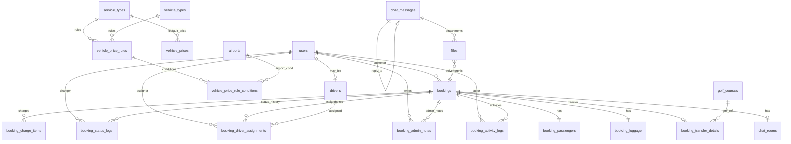

# Database Design Enhancement Review (v1.0 → v1.1)

> **상태**: schema.sql 생성 전 설계 보완 완료  
> **기준 문서**: `DATABASE_DESIGN.md` (v1.1 반영)  
> **SQL**: 미작성 — 다음 단계에서 분할 마이그레이션 파일 생성

---

## Executive Summary

v1.0 설계(약 90~95점)는 **확장형 예약 허브** 관점에서 우수했지만, **운영(관리자)·정산·CS·기사 앱** 관점 데이터가 부족했습니다. v1.1은 요금 라인 아이템, 관리자 메모, 활동 로그, 가격 규칙, 파일·감사 컬럼을 추가하고, 기사 배정·상태 이력·채팅을 운영 수준으로 강화합니다.

---

## 1. 수정된 ERD

### 1.1 논리 영역 (v1.1)

```
┌──────────────────────────────────────────────────────────────────────────────┐
│ IDENTITY        │ users, user_profiles                                         │
├─────────────────┼────────────────────────────────────────────────────────────┤
│ SERVICE CATALOG │ service_categories, service_types                            │
├─────────────────┼────────────────────────────────────────────────────────────┤
│ BOOKING CORE    │ bookings                                                     │
│                 │ booking_passengers, booking_luggage, booking_transfer_details│
│                 │ booking_charge_items          ★ NEW                          │
│                 │ booking_status_logs (강화)                                   │
│                 │ booking_driver_assignments (강화)                            │
│                 │ booking_admin_notes           ★ NEW                          │
│                 │ booking_activity_logs         ★ NEW                          │
│                 │ booking_number_sequences                                     │
├─────────────────┼────────────────────────────────────────────────────────────┤
│ FLEET & PLACES  │ vehicle_types, vehicle_prices (fallback)                     │
│                 │ vehicle_price_rules           ★ NEW                          │
│                 │ vehicle_price_rule_conditions ★ NEW                          │
│                 │ drivers (강화), driver_vehicles, airports, golf_courses        │
├─────────────────┼────────────────────────────────────────────────────────────┤
│ COMMUNICATION   │ chat_rooms, chat_participants, chat_messages (강화)            │
│                 │ chat_message_reads, notifications, notification_devices      │
├─────────────────┼────────────────────────────────────────────────────────────┤
│ STORAGE         │ files                         ★ NEW                          │
├─────────────────┼────────────────────────────────────────────────────────────┤
│ PLATFORM        │ translations, settings (강화), audit_logs                      │
└──────────────────────────────────────────────────────────────────────────────┘
```

### 1.2 관계 다이어그램 (v1.1)



### 1.3 예약·요금·운영 데이터 흐름

```
[예약 생성]
  bookings (total_amount만 합계)
    → booking_charge_items (VEHICLE_BASE, NAME_SIGN, …)
    → booking_activity_logs (BOOKING_CREATED)
    → booking_status_logs (→ PENDING)

[관리자 운영]
    → booking_admin_notes (복수 메모)
    → booking_driver_assignments (is_active=1, 재배정 시 이전 row is_active=0)
    → booking_activity_logs (DRIVER_CHANGED, …)

[채팅]
  chat_messages (+ reply_message_id, message_status)
    → files (entity_type=CHAT_MESSAGE)
```

---

## 2. 추가된 테이블

| # | 테이블 | 역할 |
|---|--------|------|
| 1 | **`booking_charge_items`** | 예약 요금 라인 아이템 (피켓·할증·쿠폰·톨게이트 등) |
| 2 | **`booking_admin_notes`** | 예약별 관리자 메모 (복수, 비공개 옵션) |
| 3 | **`booking_activity_logs`** | CS용 고객·운영 활동 이력 |
| 4 | **`vehicle_price_rules`** | 조건부 가격 규칙 (우선순위·유효기간) |
| 5 | **`vehicle_price_rule_conditions`** | 규칙 조건 (요일·시간·공항·지역·시즌 등) |
| 6 | **`files`** | 첨부파일 (채팅·예약·기사 등 polymorphic) |

### 2.1 `booking_charge_items` 컬럼

| 컬럼 | 타입 | NULL | 설명 |
|------|------|------|------|
| `id` | BIGINT UNSIGNED | NO | PK |
| `booking_id` | BIGINT UNSIGNED | NO | FK → bookings |
| `charge_type` | ENUM/VARCHAR | NO | 요금 유형 (§2.2) |
| `description` | VARCHAR(255) | YES | 표시용 설명 |
| `quantity` | DECIMAL(10,2) | NO | 1.00 |
| `unit_price` | DECIMAL(12,2) | NO | 단가 (쿠폰은 음수) |
| `amount` | DECIMAL(12,2) | NO | quantity × unit_price |
| `reference_type` | VARCHAR(30) | YES | COUPON, PROMOTION 등 FK 대상 타입 |
| `reference_id` | BIGINT UNSIGNED | YES | 쿠폰/프로모션 ID (Phase 2) |
| `metadata` | JSON | YES | 톨게이트 구간 등 |
| + audit | created_at, created_by | | |
| + soft delete | deleted_at | YES | |

**`charge_type` (seed)**  
`VEHICLE_BASE`, `NAME_SIGN`, `NIGHT_SURCHARGE`, `AIRPORT_PARKING`, `TOLL_GATE`, `PROMOTION`, `COUPON`, `DRIVER_EXTRA`, `SEASON_SURCHARGE`, `HOLIDAY_SURCHARGE`, `OTHER`

### 2.2 `booking_admin_notes` 컬럼

| 컬럼 | 타입 | 설명 |
|------|------|------|
| `id` | BIGINT UNSIGNED | PK |
| `booking_id` | FK | 예약 |
| `admin_user_id` | FK → users | 작성 관리자 |
| `note` | TEXT | 메모 본문 |
| `is_private` | TINYINT(1) | 1=내부만, 0=기사에게도 표시 가능 |
| `created_at` | DATETIME | |
| `deleted_at` | DATETIME | soft delete |

### 2.3 `booking_activity_logs` 컬럼

| 컬럼 | 타입 | 설명 |
|------|------|------|
| `id` | BIGINT UNSIGNED | PK |
| `booking_id` | FK | 예약 |
| `activity_type` | ENUM/VARCHAR | 활동 유형 (§2.4) |
| `actor_user_id` | FK nullable | 행위자 |
| `actor_role` | ENUM | CUSTOMER, DRIVER, ADMIN, SYSTEM |
| `description` | VARCHAR(500) | 사람이 읽는 요약 |
| `payload` | JSON | 변경 전·후 diff, IP 등 |
| `created_at` | DATETIME | |

**`activity_type` (seed)**  
`BOOKING_CREATED`, `BOOKING_UPDATED`, `BOOKING_CANCELLED`, `STATUS_CHANGED`, `DRIVER_ASSIGNED`, `DRIVER_UNASSIGNED`, `DRIVER_CHANGED`, `CHARGE_ADDED`, `CHARGE_REMOVED`, `CHAT_STARTED`, `CHAT_MESSAGE_SENT`, `BOOKING_COMPLETED`, `PAYMENT_UPDATED`, `NOTE_ADDED`

### 2.4 `vehicle_price_rules` 컬럼

| 컬럼 | 타입 | 설명 |
|------|------|------|
| `id` | INT UNSIGNED | PK |
| `service_type_id` | FK | 서비스 |
| `vehicle_type_id` | FK | 차량 |
| `name` | VARCHAR(100) | 관리자용 규칙명 |
| `base_price` | DECIMAL(12,2) | 이 규칙 적용 시 가격 |
| `price_modifier_type` | ENUM | FIXED, PERCENT_ADD, PERCENT_OFF |
| `price_modifier_value` | DECIMAL(12,2) | FIXED면 base_price, %면 modifier |
| `currency` | CHAR(3) | THB |
| `priority` | INT | 높을수록 우선 (100 > 10) |
| `valid_from` / `valid_to` | DATETIME | 유효 기간 |
| `is_active` | TINYINT(1) | |
| + audit | created_by, updated_by | |

> `vehicle_prices` = **priority 0 기본 fallback**. 매칭 규칙 없을 때만 사용.

### 2.5 `vehicle_price_rule_conditions` 컬럼

| 컬럼 | 타입 | 설명 |
|------|------|------|
| `id` | INT UNSIGNED | PK |
| `rule_id` | FK | vehicle_price_rules |
| `condition_type` | ENUM | §2.6 |
| `condition_value` | VARCHAR(100) | 값 (요일 번호, 공항 IATA, region 코드 등) |
| `operator` | ENUM | EQ, IN, BETWEEN, GTE, LTE |

**`condition_type`**  
`DAY_OF_WEEK`, `TIME_RANGE`, `IS_HOLIDAY`, `SEASON`, `ORIGIN_AIRPORT`, `DEST_REGION`, `SERVICE_TYPE` (중복 검증용)

예: 심야 할증 = `TIME_RANGE` + `22:00-06:00`  
예: BKK 출발 = `ORIGIN_AIRPORT` + `BKK`

### 2.6 `files` 컬럼

| 컬럼 | 타입 | 설명 |
|------|------|------|
| `id` | BIGINT UNSIGNED | PK |
| `entity_type` | VARCHAR(30) | BOOKING, CHAT_MESSAGE, DRIVER, USER |
| `entity_id` | BIGINT UNSIGNED | 대상 ID |
| `storage_provider` | ENUM | LOCAL, S3 |
| `file_path` | VARCHAR(512) | 내부 경로 |
| `file_url` | VARCHAR(1024) | 공개 URL |
| `mime_type` | VARCHAR(100) | |
| `file_size` | BIGINT UNSIGNED | bytes |
| `original_filename` | VARCHAR(255) | |
| `uploaded_by_user_id` | FK | |
| `created_at` | DATETIME | |
| `deleted_at` | DATETIME | |

---

## 3. 추가·변경 컬럼 (기존 테이블)

### 3.1 `bookings` — 요금 구조 단순화

| 변경 | 컬럼 | 설명 |
|------|------|------|
| **유지** | `total_amount` | charge_items 합계 스냅샷 (확정 시점) |
| **유지** | `currency`, `payment_status` | |
| **제거** | `vehicle_base_price`, `additional_charges`, `name_sign_service`, `name_sign_fee`, `discount_amount` | → `booking_charge_items`로 이전 |
| **선택 유지** | `pricing_rule_id` | 적용된 vehicle_price_rule FK (감사·재계산) |

**변경 이유**: 요금 항목이 늘어날 때마다 `bookings` 컬럼을 추가하는 방식은 운영·정산·환불 계산에 불가능. 라인 아이템은 쿠폰(음수)·프로모션과 1:1 대응.

### 3.2 `booking_status_logs` — 강화

| 컬럼 | 변경 | 설명 |
|------|------|------|
| `changed_by_user_id` | 유지 (v1.0) | 변경자 |
| `changed_by_role` | 유지 | CUSTOMER, DRIVER, ADMIN, SYSTEM |
| `reason` | **추가** | 변경 사유 코드/카테고리 (CANCEL_BY_CUSTOMER 등) |
| `memo` | **추가** | 관리자·기사 메모 (기존 `note` 분리) |
| `from_status` / `to_status` | 유지 | |

### 3.3 `booking_driver_assignments` — 재배정 지원

| 컬럼 | 변경 | 설명 |
|------|------|------|
| `assigned_at` | 유지 | 배정 시간 |
| `unassigned_at` | **추가** | 배정 해제 시간 |
| `assignment_reason` | **추가** | 배정/변경 사유 |
| `assigned_by_user_id` | 유지 (v1.0 `assigned_by`) | 배정 관리자 |
| `is_active` | **추가** | 현재 활성 배정 (1=현재, 0=이력) |
| `status` | 유지 | ASSIGNED, ACCEPTED, REJECTED, … |

**규칙**: 재배정 시 기존 row `is_active=0`, `unassigned_at` 설정 → 새 row INSERT. `bookings.driver_id`는 활성 row와 동기화.

### 3.4 `chat_messages` — 답글·상태

| 컬럼 | 변경 | 설명 |
|------|------|------|
| `reply_message_id` | **추가** | FK → chat_messages (self) |
| `message_status` | **추가** | SENT, DELIVERED, READ |
| `delivered_at` | **추가** | DELIVERED 시각 (선택) |

> 참여자별 READ는 기존 `chat_message_reads` 유지. `message_status`는 메시지 전역 최소 상태(푸시·UI용).

### 3.5 `drivers` — 기사 앱 상태

| 컬럼 | 변경 | 설명 |
|------|------|------|
| `current_lat`, `current_lng` | 유지 (v1.0) | 현재 위치 |
| `location_updated_at` | 유지 | |
| `is_online` | **추가** | 온라인 여부 (앱 연결) |
| `last_seen_at` | **추가** | 마지막 접속/heartbeat |
| `status` | 유지 | AVAILABLE, ON_TRIP, OFFLINE, SUSPENDED |

### 3.6 `airports` — 확인·명시

| 컬럼 | 상태 | 설명 |
|------|------|------|
| `timezone` | v1.0 유지, **필수 권장** | Asia/Bangkok — 항공·픽업 시간 변환 |
| `country_code` | v1.0 유지 | ISO CHAR(2) |

### 3.7 `golf_courses` — 보강

| 컬럼 | 상태 | 설명 |
|------|------|------|
| `region` | 유지 | 지역 |
| `place_id` | 유지 | Google Place ID |
| `lat`, `lng` | 유지 | 위도·경도 |
| `phone` | **추가** | VARCHAR(30) |
| `website` | **추가** | VARCHAR(512) |

### 3.8 `settings` — data_type

| 컬럼 | 변경 | 설명 |
|------|------|------|
| `value` | 유지 | |
| `data_type` | **추가/정리** | STRING, NUMBER, BOOLEAN, JSON |
| `is_encrypted` | 유지 | SECRET 타입은 data_type=STRING + is_encrypted=1 |
| `value_type` (v1.0) | **제거·통합** | → `data_type`로 일원화 |

### 3.9 Audit 컬럼 (공통 패턴)

**적용 대상 (주요 테이블)**  
`bookings`, `booking_charge_items`, `drivers`, `driver_vehicles`, `vehicle_price_rules`, `airports`, `golf_courses`, `settings`, `files`

| 컬럼 | 타입 | NULL | 설명 |
|------|------|------|------|
| `created_by` | BIGINT UNSIGNED | YES | FK → users |
| `updated_by` | BIGINT UNSIGNED | YES | FK → users |

+ 기존 `created_at`, `updated_at`, `deleted_at`

**적용하지 않는 테이블**  
로그성 테이블 (`booking_status_logs`, `booking_activity_logs`, `chat_messages`) — 자체 actor 컬럼으로 충분.

**변경 이유**: SUPER_ADMIN 감사, CS 분쟁, 가격 규칙 변경 추적. 애플리케이션 레이어에서 JWT user id 자동 주입.

---

## 4. 변경 이유 (항목별)

| # | 요구 | 문제 (v1.0) | v1.1 해결 |
|---|------|-------------|-----------|
| 1 | 요금 라인 | 컬럼 증식·정산 불가 | `booking_charge_items` |
| 2 | 상태 이력 | note만 존재 | `reason` + `memo` 분리 |
| 3 | 기사 재배정 | 단순 배정 이력 | `is_active`, `unassigned_at`, 사유 |
| 4 | 관리자 메모 | `admin_notes` 단일 TEXT | `booking_admin_notes` 복수·비공개 |
| 5 | CS 로그 | 없음 | `booking_activity_logs` |
| 6 | 채팅 답글 | 없음 | `reply_message_id`, `message_status` |
| 7 | 파일 | 없음 | `files` polymorphic |
| 8 | 기사 앱 | 위치만 | `is_online`, `last_seen_at` |
| 9 | 가격 정책 | service+vehicle만 | rules + conditions |
| 10~12 | 마스터·설정 | 대부분 있음 | phone/website, data_type 명시 |
| 13 | Audit | 부분적 | created_by/updated_by 패턴 |
| 14 | API 분리 | 미검토 | DB·역할·로그로 앱 레이어 분리 가능 (§5) |

---

## 5. API 확장 가능성 검토 (REST / WebSocket / Admin / Driver / Customer)

DB는 **API 프로세스를 분리하지 않지만**, 다음 설계로 **애플리케이션 레이어 분리를 완전히 지원**합니다.

| API Surface | 주요 테이블 | DB 설계 지원 |
|-------------|-------------|--------------|
| **Customer REST** | bookings, charge_items (read), places | `customer_user_id`, activity log actor_role |
| **Driver REST** | assignments (is_active=1), drivers 위치 | `is_online`, `last_seen_at`, assignments |
| **Admin REST** | 전체 + admin_notes, activity, rules | role=ADMIN, is_private 메모 |
| **WebSocket (Chat)** | chat_*, message_status | room_code, reads, reply |
| **WebSocket (Driver 위치)** | drivers lat/lng | heartbeat → last_seen_at |

**권장 아키텍처 (앱 레이어, DB 무관)**

```
api-customer/   → Customer JWT, bookings CRUD (제한)
api-driver/     → Driver JWT, assignments, location
api-admin/      → Admin JWT, full CRUD
api-internal/   → WebSocket gateway (Socket.IO)
```

**DB 추가 권장 (선택, Phase 2)**  
- `api_clients` — B2B 파트너 키 (Affiliate)  
- Views: `v_active_driver_assignments`, `v_booking_charge_summary` — API별 조회 단순화

**결론**: 단일 MySQL로 유지 가능. API 분리는 **서비스·권한 레이어**에서 처리하고, DB는 role·activity_log·is_active로 정합성 보장.

---

## 6. 향후 확장성

| 영역 | 확장 방식 |
|------|-----------|
| **요금** | charge_type ENUM 확장 또는 VARCHAR; 쿠폰은 reference_id + 음수 amount |
| **가격 정책** | rule_conditions 행 추가만으로 요일·시즌·공항 조합 |
| **정산** | charge_items GROUP BY charge_type → 기사·회사 배분 테이블 추가 |
| **채팅 파일** | files.entity_type=CHAT_MESSAGE + chat_messages FK |
| **Storage** | storage_provider LOCAL → S3, file_path/url만 변경 |
| **CS** | activity_logs payload JSON에 diff; 티켓 시스템 연동 시 booking_id FK |
| **기사 앱** | is_online + geo index (Phase 2 SPATIAL) |
| **감사** | audit_logs 테이블 + created_by 트리거 (선택) |

---

## 7. schema.sql 분할 전략 (권장)

단일 `schema.sql`은 초기 개발엔 편하지만, 여행 플랫폼 확장 시 **도메인별 분할**이 유지보수에 유리합니다. 사용자 제안을 기반으로 **의존성 순서 + 인덱스·시드 분리**를 권장합니다.

```
database/
├── 00_database.sql          # CREATE DATABASE, charset
├── 01_identity.sql          # users, user_profiles
├── 02_service_catalog.sql   # service_categories, service_types
├── 03_fleet_places.sql      # vehicle_types, vehicle_prices, rules, conditions,
│                            # drivers, driver_vehicles, airports, golf_courses
├── 04_booking_core.sql      # bookings, passengers, luggage, transfer,
│                            # charge_items, status_logs, assignments,
│                            # admin_notes, activity_logs, number_sequences
├── 05_chat.sql              # chat_rooms, participants, messages, reads
├── 06_notification.sql      # notifications, notification_devices
├── 07_storage.sql           # files
├── 08_platform.sql          # translations, settings, audit_logs (선택)
├── 09_indexes.sql           # 추가 인덱스 (테이블 생성 후 일괄)
├── 10_views.sql             # v_active_assignments, v_charge_summary
├── 11_seed.sql              # 마스터·기본 요금
└── migrate.sh / migrate.ps1 # 순서대로 실행
```

**추가 권장 (사용자 제안 대비)**

| 파일 | 이유 |
|------|------|
| `09_indexes.sql` 분리 | 대형 테이블 생성 후 인덱스 일괄 적용 → DDL 속도·가독성 |
| `10_views.sql` | Admin/Driver API용 조회 단순화, 앱 코드 중복 제거 |
| `migrate.ps1` | Windows(Gabia) + CI 동일 실행 |

향후 Phase 2: `12_commerce.sql` (payments, wallets, …)

---

## 8. v1.1 Index 추가 (요약)

| 테이블 | 인덱스 |
|--------|--------|
| `booking_charge_items` | `(booking_id)`, `(charge_type)` |
| `booking_admin_notes` | `(booking_id, created_at)` |
| `booking_activity_logs` | `(booking_id, created_at)`, `(activity_type)` |
| `booking_driver_assignments` | `(booking_id, is_active)`, `(driver_id, is_active)` |
| `vehicle_price_rules` | `(service_type_id, vehicle_type_id, priority)` |
| `vehicle_price_rule_conditions` | `(rule_id, condition_type)` |
| `files` | `(entity_type, entity_id)` |
| `chat_messages` | `(reply_message_id)`, `(message_status)` |
| `drivers` | `(is_online, status)`, `(last_seen_at)` |

---

## 9. 다음 단계

1. `DATABASE_DESIGN.md` v1.1 본문 동기화 (본 문서와 일치)  
2. `database/00~11` 분할 SQL 작성  
3. 예약 생성 트랜잭션 순서 문서화: bookings → charge_items → activity_log → status_log → chat_room  
4. `total_amount` = SUM(charge_items.amount) 애플리케이션 규칙 확정

---

*Review version: 1.1 | 2026-06-26*
